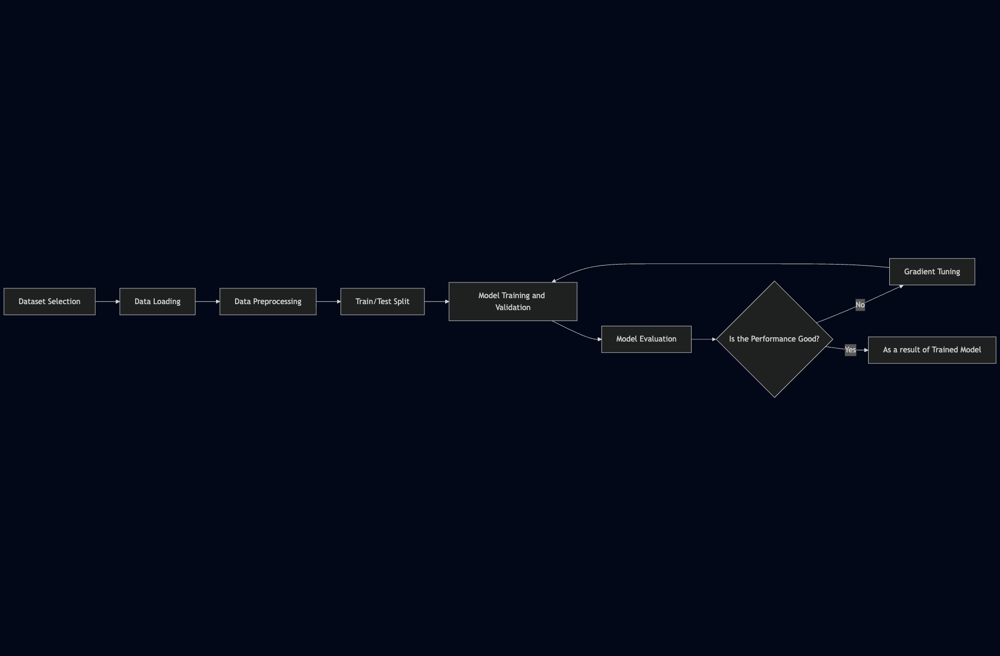

# Housing Price Prediction (Lab 2)

## Project Overview

This project focuses on predicting house prices using machine learning. By analyzing various features of a house—such as its area, number of bedrooms, and furnishing status—we aim to build a regression model that can accurately estimate its market value.

This repository serves as the submission for **Lab 2: Identifying ML Problems, Selecting Open Datasets, and Drawing a Methodology Diagram**.

## Dataset

* **Source:** Housing Prices Dataset from Kaggle/UCI
* **File:** `Housing.csv`
* **Description:** The dataset contains 545 records of houses with 13 features, including:
    * **Numerical:** `area`, `bedrooms`, `bathrooms`, `stories`, `parking`
    * **Categorical:** `mainroad`, `guestroom`, `basement`, `hotwaterheating`, `airconditioning`, `prefarea`, `furnishingstatus`
* **Target Variable (Label):** `price` (**`Continuous`** numerical value)

## Problem Statement

* **Problem Type:** Regression
* **Goal:** To train a model that minimizes the error between the predicted price and the actual sale price.
* **Why?** accurately predicting housing prices helps buyers and sellers determine fair market value.

## Graph Visualization

The project follows a standard machine learning workflow:

1. **Data Loading:** Importing the CSV file into a Pandas DataFrame.
2. **Preprocessing:**
    * Checking for missing values and duplicates.
    * Converting categorical text data (e.g., "yes"/"no") into numerical format (0/1) using One-Hot Encoding.
3. **Exploratory Data Analysis (EDA):** Visualizing correlations, such as the strong relationship between `area` and `price`.
4. **Model Training:**
    * Splitting data into 80% training and 20% testing sets.
    * Training multiple models (Linear Regression, Random Forest, Gradient Boosting).
5. **Evaluation:** Measuring performance using R² Score and Root Mean Squared Error (RMSE).

</img>

## Results

We experimented with different models to find the best fit:

| Model | R² Score | Performance |
| :--- | :--- | :--- |
| **Linear Regression** | 0.6529 | Baseline (Weak) |
| **Random Forest Regressor** | 0.6119 | Strong |
| **Gradient Boosting** | **0.6660** | **Best Performance** |

The final model successfully explains approximately **66%** of the price variation.

## Tools & Libraries Used

* **Python:** The primary programming language.
* **Pandas:** For data manipulation and analysis.
* **Matplotlib & Seaborn:** For data visualization.
* **Scikit-Learn:** For model training, evaluation, and preprocessing.
* **Joblib:** For saving the trained model.

## How to Run

1. Clone this repository:

    ```bash
    git clone https://github.com/MuhMutlaq/IAU-Machine-Learning-Labs.git
    ```

2. Navigate to the branch:

    ```bash
    git checkout Lab2
    ```

3. Install dependencies:

    ```bash
    pip install pandas numpy matplotlib seaborn scikit-learn
    ```

4. Run the Jupyter Notebook:

    ```bash
    jupyter notebook lab2_notebook.ipynb
    ```

* **Course:** ARTI 308 – Machine Learning
* **Institution:** Imam Abdulrahman Bin Faisal University
